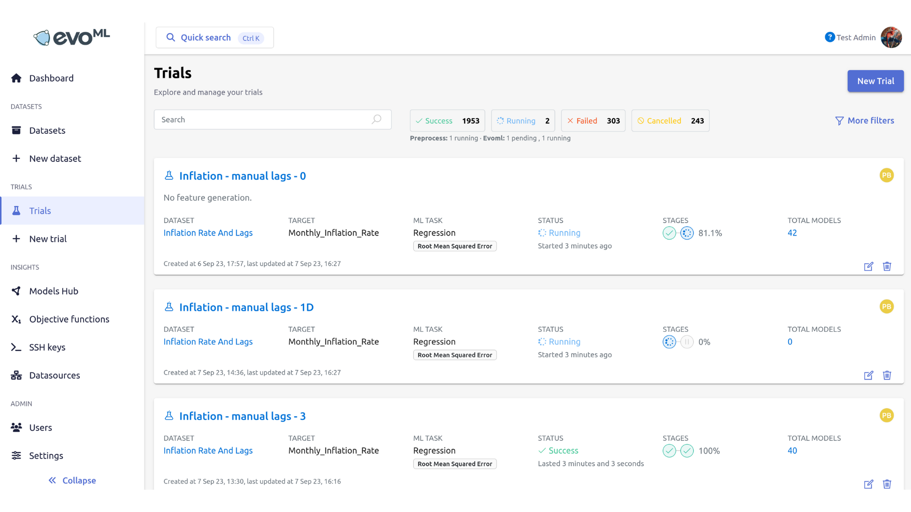
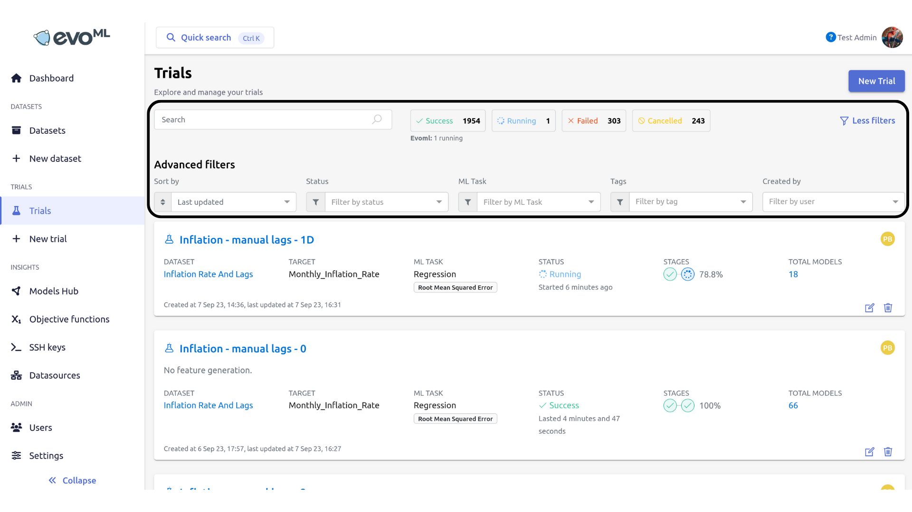
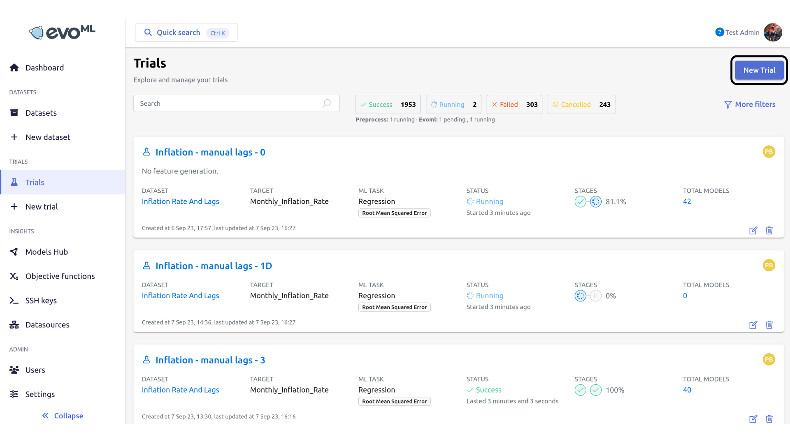
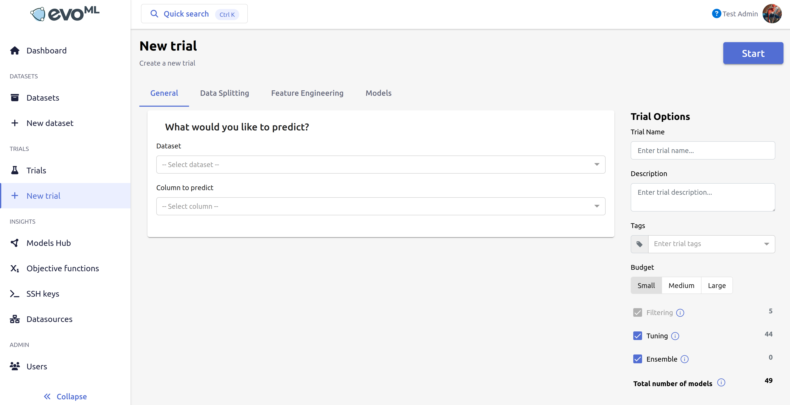

_For complete documentation, see [evoML user documentation](https://docs.evoml.ai/)_
# Trials

On evoML, a "trial" is the term used to refer to the end-to-end model building process. A trial consists of data preprocessing, feature engineering, model building, and model evaluation.

_Trials_ tab lists all attempted trials, by default arranged by date and time of last update, and gives you the option to create a new trial. See figure below for an overview of the _Trials_ tab.

On top left you will find the number of successful, running, pending, failed, and cancelled attempts.

Each trial entry contains the following metadata: (1) dataset, (2) target, (3) ML task, (4) status, (5) stages, (6) best model, and (7) total models. Options to edit and delete trials are at the bottom right corner of each trial entry.

Use the filter options on top of the list of trials (see figure below) to find a specific trial based on given filter criteria.

Use the search bar to free search existing trials. Further filtering is possible through the _Last updated_, _Filter by status_, _Filter by ML Task_, _Filter by tag_, and _Filter by user_ filters. (Click on the Filters icon if you are unable to see any of these filters).

## Building a new machine learning pipeline

Developing a machine learning model for a selected machine learning task can be done using an existing or a newly created dataset (To find out how to create a new dataset, see previous section, _Datasets_.) Under the main _Trials_ tab, click _New Trial_ on the top right corner to start a new trial (see figure below).

Clicking _New Trial_ will open the page below:

Customising a trial can be done along various criteria provided. These customisation options are provided under _New Trial_, and includes six sections, general, data splitting, features, feature selection, feature generation, and models. 

These sections are disucussed in detail below:

### Model configuration

**Using the _Dataset_ drop-down menu, select a dataset for your task.**

**Use the _Column to predict_ drop-down menu to select the column (feature) that you want to use to make predictions.**

Based on your dataset, evoML will determine the machine learning task for the trial. You are also able to change this if required.

**Machine learning task: Classification**
    
In classification problems, the machine learning models aim to predict if a given point of input data belongs to one of given categories.
If the column/feature you choose to predict is of a binary or categorical data type, then evoML will automatically detect this as a classification problem. The feature analysis visualisations you receive will be bar graphs.

**Machine learning task: Regression**
    
In regression problems, the machine learning models aim to predict the value of a given numerical entity.
If the column/feature you choose to predict is of a numerical data type, then evoML will automatically detect this as a regression problem. The feature analysis visualisations you receive will be histograms, density plots, and box plots.

**Machine learning task: Forecasting**
    
In forecasting problems, machine learning models aim to forecast future values the target variable.

If you choose a feature with only binary values (for instance, employed and unemployed) the platform will display a _Positive binary label_ drop-down menu to select one of the binary values. The options you see on the drop-down menu will be the two symbols you use to denote the binary values in your dataset.

If your dataset includes a column on employment where “employed” is denoted by 1 and “unemployed” is denoted by 0, then your _Positive binary label_ drop-down will have 1 and 0 as its two options.

Choosing whether time series will ensure that during the data splitting stage the chronological order of data will be preserved.

Setting the positive binary label allows for the model to calculate model evaluation metrics accurately.

On the right hand panel, you will find the models that evoML has selected to develop, based on your chosen machine learning task, along with a further summary of the dataset and trial.

### Data splitting

In this section, you are able to customise the data splitting options for the selected dataset. Data splitting options include the preferred split of the dataset to training and testing data, and the split of data for model validation. 

#### Methods of data splitting

| Splitting method | Details |
|---|---|
| Percentage split | In percentage split, train and test data split will be made as a percentage of the original dataset. By default, evoML selects 80% of the original dataset as a training set, and 20% of the original dataset as the test set. |
| Split by index | In split by index, the first X number (X is a number you determine) of data points will be taken as the training set, and the remainder will be taken for the test set. |
| Use custom dataset | By selecting this option, you are able to retain the entire original dataset for training, and use a separate custom dataset to test your model. |

#### Methods for data validation

| Validation method | Details |
|---|---|
| Holdout | The training set of data will be sub-divided into two, where one will be used for training, and the other will be used for validation. |
| K-folds cross validation | The training dataset will be divided into K subsets. One of those subsets will be placed aside, and the model will be fitted on the K-1 data. The portion of data that was set aside will be used for model validation. |

